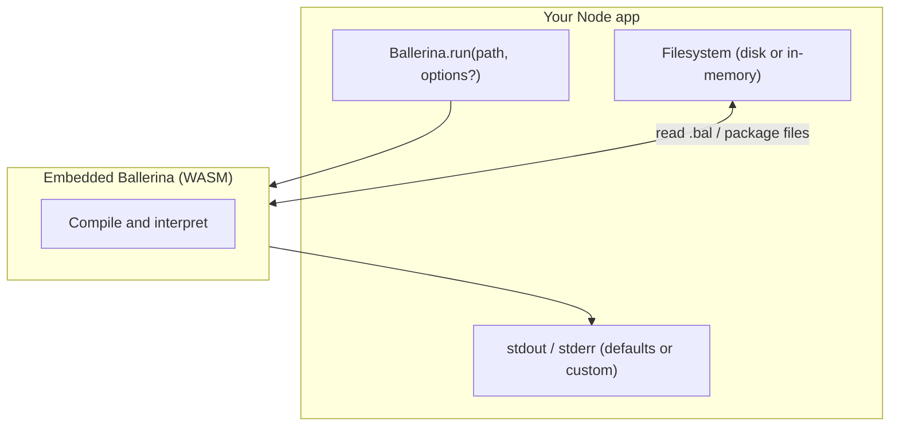

## Installation

```bash
npm install @snelusha/balrun
```

## CLI

```bash
npx @snelusha/balrun ./main.bal
```

Give a `.bal` file, a package directory, or `.` for the current package.

## Usage

```ts
import { Ballerina } from "@snelusha/balrun";

const ballerina = new Ballerina();

// null on success, or { error: "..." } on failure
const result = await ballerina.run("./main.bal");
```

### `colors`

By default, diagnostics are printed with ANSI colors. Pass `colors: false` to disable them.

```ts
await new Ballerina({ colors: false }).run("./main.bal");
```

The `balrun` CLI sets `colors: Boolean(process.stderr.isTTY)`, so colors are on in interactive terminals and off when stderr is piped.

### `stdout` and `stderr`

By default, Ballerina `io:println` output goes to `process.stdout`, and compiler diagnostics (and internal panic traces) go to `process.stderr`. Pass the second argument to `run` to use different [`Writable`](https://nodejs.org/api/stream.html#class-streamwritable) streams—for example to capture output in tests or append to a log file.

```ts
import fs from "node:fs";
import { Ballerina } from "@snelusha/balrun";

const log = fs.createWriteStream("run.log");
await new Ballerina().run("./main.bal", { stdout: log, stderr: log });
```

### Custom `FS`

By default, `Ballerina` uses `NodeFS` to read files from disk. You can swap this out with any custom filesystem by implementing the `FS` interface and passing it in.

```ts
import { Ballerina, type FS } from "@snelusha/balrun";

class MemFS implements FS {
	// When running a single file, only `open` and `stat` are required.
	// When running a package, `readDir` is also required.
}

const fs = new MemFS({ "main.bal": `...` });
await new Ballerina({ fs }).run("main.bal");
```

See [`examples/mem-fs`](https://github.com/snelusha/balrun/tree/main/packages/balrun/examples/mem-fs) for a full `MemFS` implementation.

## How it works

At a high level, **your Node process** calls `Ballerina.run` with a path and (optionally) how to read files and where to write program and diagnostic output. **An embedded Ballerina engine**—the same compiler and runtime as [ballerina-lang-go](https://github.com/ballerina-platform/ballerina-lang-go), packaged as **WebAssembly**—loads sources through that filesystem, **compiles** them, then **runs** the program. Unless you override them in `BallerinaRunOptions`, streams default to the host process `stdout` and `stderr`.



## Limitations

- The `FS` interface is synchronous only; asynchronous filesystems are not supported.

## Acknowledgements

Built on [ballerina-lang-go](https://github.com/ballerina-platform/ballerina-lang-go), the Ballerina platform's Go-based compiler and runtime.